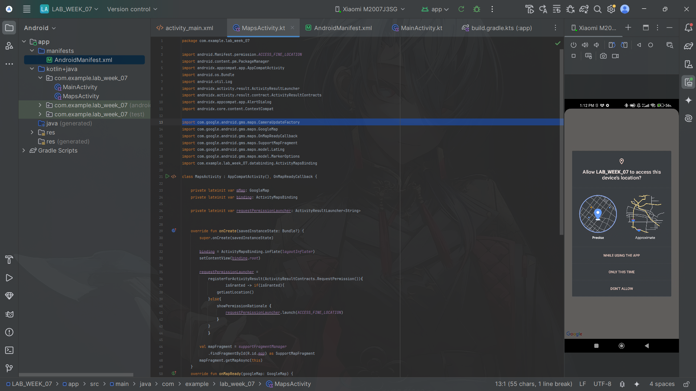
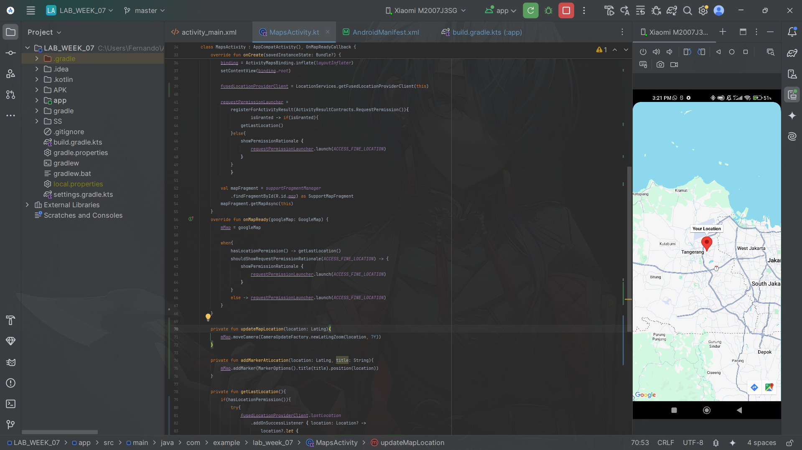
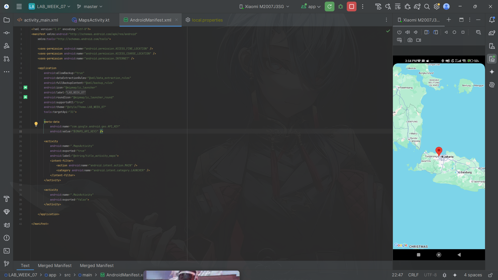

### Submitted by:
* **Nama:** Fernando Sunarto
* **NIM:** 00000083441
* **Class:** AL
---

### Project Files
| Commit | Description | APK Download | Screenshot Preview |
| :---: |---------------------------------------------|:---:|:---:|
| **01** | **Maps Activity and Location Permission** | [📱 Download APK](APK/Commit1_MapsActivity_And_Location_Permission.apk) |  |
| **02** | **Google Map API and Pinpoint** | [📱 Download APK](APK/Commit2_GoogleMapAPI_and_Pinpoint.apk) |  |
| **03** | **Secure API** | [📱 Download APK](APK/Commit3_Secure_API.apk) |  |

### Code that Changed for Assignment
1. **build.gradle.kts(:app):**
```diff
plugins {
    alias(libs.plugins.android.application)
    alias(libs.plugins.kotlin.android)
+   alias(libs.plugins.google.android.libraries.mapsplatform.secrets.gradle.plugin)
}
```
Description: Add Secrets Gradle Plugin for its can acess "local.properties"

2. **AndroidManifest.xml:**
```diff
 <meta-data
    android:name="com.google.android.geo.API_KEY"
-   android:value= " " <!--There is no API here :> -->
+   android:value="${MAPS_API_KEY}" />
```
Description: Change from API key in value into ```"{MAPS_API_KEY}"``` that located on "local.properties"

3. **local.properties (its on .gitignore so its not sended to github):**
```diff
+   MAPS_API_KEY = #YOUR API KEY
```
Description: Change location of API key from AndroidManfiest.xml into Secure place
